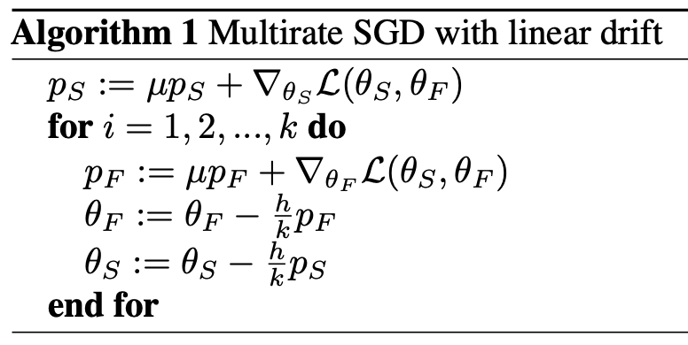

# Code accompanying "Multirate Training of Neural Networks", ICML 2022

We provide a torch.optimizer corresponding to the following multirate algorithm (with base algorithm SGD with momentum):  

To generate the transfer learning results in Section 4 of our paper one simply loads in the optimizer using:

    from Optimizer_multirate import Multirate
    optimizer = Multirate(net.parameters(),lr=h,momentum=mu)  # where net is the considered neural network, and h and mu are as defined in Algorithm 1

Then one initializes the momenta in epoch 0 for the first batch using: optimizer.initmom() (after calling loss.backward).  
If one sets the fast parameters to be the final fully connected (fc) layer, then the training loop becomes:  
    
    for batch_idx, (inputs, targets) in enumerate(loader_train): 
        if (batch_idx+1) % k == 0: #where k is as defined in Algorithm 1
            for param in net.parameters():
                param.requires_grad = True

            for param in net.fc.parameters():
                param.requires_grad = False

            optimizer.zero_grad()
            outputs = net(inputs)
            loss = criterion(outputs, targets) 
            loss.backward()

            optimizer.stepslow()

            for param in net.parameters():
                param.requires_grad = False

            for param in net.fc.parameters():
                param.requires_grad = True

        else:
            optimizer.zero_grad()
            outputs = net(inputs)
            loss = criterion(outputs, targets) 
            loss.backward()

            optimizer.stepfast()
